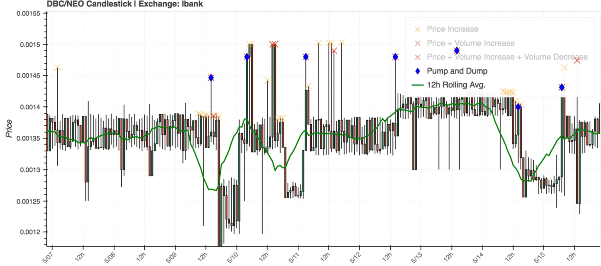
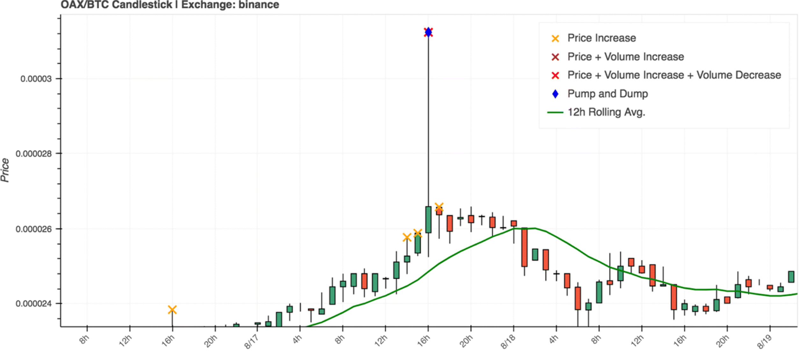
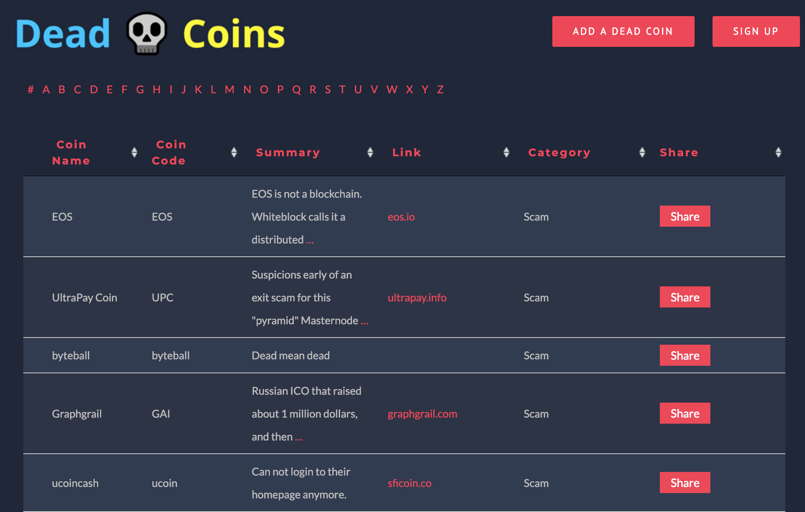

## {data-background="./ucl_artwork/ucl-banner-land-darkblue-rgb.png" data-background-size="70%" data-background-position="top" data-background-opacity="1"}

### **Cryptocurrency fraude**

 
 

_Bennett Kleinberg_

<small>Department of Security and Crime Science</small>
 
<small>Dawes Centre for Future Crime</small>
 
<small>University College London</small>

## 
<!-- {data-background="./sharessinger.jpg" data-background-size="50%" data-background-position="center" data-background-opacity="1"} -->

##

## Anatomie van een P&D

<small>De drie fases van een pump-and-dump operatie [(Kamps & Kleinberg, 2018)](https://crimesciencejournal.biomedcentral.com/articles/10.1186/s40163-018-0093-5)</small>

## Twee gebeurtenissen

1. Het Internet
2. Cryptocurrencies

##

**What could go wrong?**

##

> The recent explosion of nearly 2,000 cryptocurrencies in a largely unregulated environment has greatly expanded the scope for abuse.

<small>[Hamrick et al., 2018](https://papers.ssrn.com/sol3/papers.cfm?abstract_id=3303365)</small>

##

### The story of [OfficialMcAfee](https://www.buzzfeednews.com/article/ryanmac/heres-how-scammers-are-using-fake-news-to-screw-with-bitcoin) and [OfficiallMcAfee](https://www.buzzfeednews.com/article/ryanmac/heres-how-scammers-are-using-fake-news-to-screw-with-bitcoin).

<small>from: [Mac & Lytvynenko, Buzzfeed, 2018](https://www.buzzfeednews.com/article/ryanmac/heres-how-scammers-are-using-fake-news-to-screw-with-bitcoin)</small>

## Coin of the day ...

> When the tweet was first broadcast at around 3 p.m. ET, GVT was bought and sold on the market at $30.

##

> When the tweet was first broadcast at around 3 p.m. ET, GVT was bought and sold on the market at $30.

> By 3:04, it was at $45, and trading volume had doubled.

##

> When the tweet was first broadcast at around 3 p.m. ET, GVT was bought and sold on the market at $30.

> By 3:04, it was at $45, and trading volume had doubled.

> But by 3:19, GVT's price had fallen back to $30.29.

## Morale of the story

> But by 3:19, GVT's price had fallen back to $30.29.

> The smart money — the early money — had gotten out, leaving the late money holding a bag of now-diminished value.

## Crypto P&Ds

| Oude uitdagingen            	| Nieuwe uitdagingen                 	|
|------------------------------	|------------------------------------	|
| lage market cap             	| kortere tijd (bijna real-time) 	|
| gebrek aan informatie 	      | grotere verspreiding van misinformatie |
| zeer lage price              	| nieuwe vormen van geruchten        	|

## 

### Maar ja... dat is ook maar één probleem

<!-- cash analogy -->

## Maar wel met **$$$**

- $50m (Onecoin)
- $825m over zes maanden
- [$222m voor een groep](https://www.wsj.com/graphics/cryptocurrency-schemes-generate-big-coin/)

## Het "grey zone" probleem

## 

### Kunnen we P&Ds detecteren?

## Data

- gescraped van cryptocurrency platforms
- transactie data met 1-uur resolutie
- 20 dagen transacties, 5 platforms, 977 transactie paren

<small>Data + code [https://osf.io/827wd/](https://osf.io/827wd/)</small>

## Criteria voor een P&D

- plots prijs stijging (PUMP)
- plots toename in volume (PUMP)
- duidelijke prijs drop (DUMP)

_Conditional local point anomaly detection_

## Anomalie parameters

<!-- |                   	| Strict parameters 	| Balanced parameters 	| -->
<!-- |-------------------	|-------------------	|---------------------	| -->
<!-- | Estimation window 	| 24h               	| 12h                 	| -->
<!-- | Volume increase   	| 400%              	| 300%                	| -->
<!-- | Price increase    	| 10%               	| 5%                  	| -->
<!-- | Price drop        	| 1.00 SD           	| 1.00 SD             	| -->
<!-- | Alleged pumps     	| 920               	| 2150                	| -->
<!-- | Pump-and-dumps    	| 485               	| 1617                	| -->
<!-- | Crypto/crypto     	| 97.9%             	| 97.0%               	| -->
<!-- | Low market cap    	| 84.9%             	| 81.8%               	| -->

|                   	| Balanced parameters 	|
|-------------------	|---------------------	|
| Estimation window 	| 12h                 	|
| Volume increase   	| 300%                	|
| Price increase    	| 5%                  	|
| Price drop        	| 1.00 SD             	|
| Alleged pumps     	| 2150                	|
| Pump-and-dumps    	| 1617                	|
| Crypto/crypto     	| 97.0%               	|
| Low market cap    	| 81.8%               	|

## P&D detectie

## Bevindingen

- **potentie for detectie**
- **voornamelijk crypto/crypto transacties**
- **voornamelijk lage market cap**

## Intermezzo: situational crime prevention

- weg van het crimonologisch-sociologisch model
- weg van het individualiserende model
- fraude/misdaad als complex probleem
- ... in situationele omstandigheden
- robuust effect: clustering

## Betekenis voor cryptocurrency

- begrijpen van _P&D situatie_
- is er sprake van clustering?

## Zooming in

- Platforms
    - % transacties $\neq$ % P&Ds
    - Somemige platforms zijn meer gebruikt dan anderen
    - bijv. "Kraken": 6% transacties, < 1% P&Ds
    - een van de meest gereguleerde marktplaatsen

## Zooming in

- Coins
    - Meeste coins nooit "slachtoffer"
    - Sommige coins zijn continu aangevallen
    - 30% coins $\sim$ 80% P&Ds

## Herhaaldelijke victimisatie van coins

## Hoofd bevindingen

- potentie voor detectie
- voornamelijk crypto/crypto transacties
- voornamelijk lage market cap
- **herhaaldelijke victimisatie van platforms**
- **herhaaldelijke victimisatie van coins**
- geen bewijs voor _"Bitcoin is not immune from the pump-and-dump phenomenon"_ (Hamrick et al., 2018)

## In context

- P&D groepen successvol om prijs omhoog te jagen
- (zeer) korte tijdslijn
- Telegram en Discord gebruikt voor het organiseren en coördineren
- coins met lage volume meest aantrekkelijk

<small>zie [Kamps & Kleinberg, 2018](https://doi.org/10.1186/s40163-018-0093-5); [Xu & Livshits, 2018](https://arxiv.org/pdf/1811.10109.pdf); [Hamrick et al., 2018](https://papers.ssrn.com/abstract=3303365); [Li et al., 2018](https://papers.ssrn.com/abstract=3267041)</small>

## Real-world tests

##

### Visie op onderzoek & bigger picture

## Old-school aanpak

1. detectie
2. preventie

Circulair probleem.

## Lopend onderzoek

- Detectie:
    - Signalen in de accumulatie fase
    - Signalen in de pump fase
- Anticipatie:
    - Veranderingen in MO
    - Transitie naar nieuwe coins

Interdisciplinary challenge!

##

## Nieuwe problemen

- Twitter imitaties
- Veranderingen in verspreiding (kat - muis spel)
- Transacties in milliseconden

##

### We moeten weg van oude (denk) modellen

## Nieuwe vragen

- vertrouwen
    - hoe kiezen ze een leider?
    - hoe behouden ze intern vertrouwen?
    - hoe wordt gestraft?

## Nieuwe vragen

- vertrouwen
- groep-dynamiek
    - hoe loopt de recruitment?
    - hoe maak je carriere?

## Nieuwe vragen

- vertrouwen
- groep-dynamiek
- beslissingsprocessen
    - hoe kiezen ze "targets"?
    - waat zijn de kosten-baten processen?
    - wat zien wij niet?

## Situationele preventie

- situatie veranderen, bij.
    - "increase the risk"
    - "increase the effort"
    - "reduce the reward"
    - "remove excuses"

## Situationele preventie

- is er sprake van displacement?
    - hoe?
    - waar naar toe?

## Visie op toekomstig onderzoek

Realistisch: ground truth data + detectie

1. samenwerking tussen universiteiten en fintech, overheid, banken, "citizen science"

##

## Visie op toekomstig onderzoek

Realistisch: ground truth data + detectie

1. samenwerking tussen universiteiten en fintech, overheid, banken, "citizen science"
2. infiltratie van groepen
3. eigen P&D

## Zijn cryptocurrencies de toekomst van fraude?

~~Ja~~ Misschien ~~Nee~~

## Daarom:

Wat weten wij niet?

En wat zijn de cryptofraude uitdagingen voor de toekomst?

**10-11 juni, cryptofraude "sandpit" in Londen**

## Einde.

Promovendi + post-docs: Josh Kamps, Florian Hetzel, Eray Akartuna

<small>bennett.kleinberg@ucl.ac.uk // [bkleinberg.net](https://bkleinberg.net/)</small>

-------

