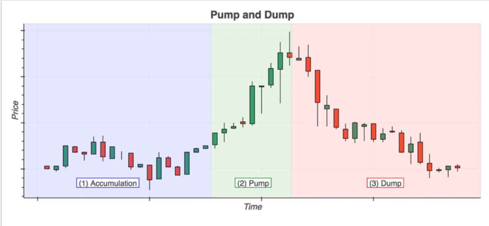
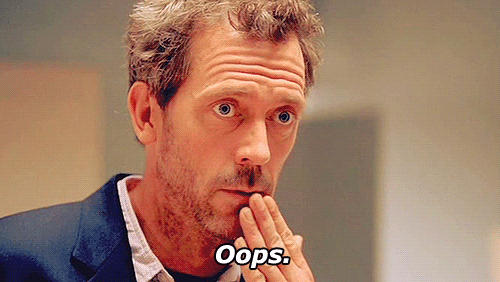
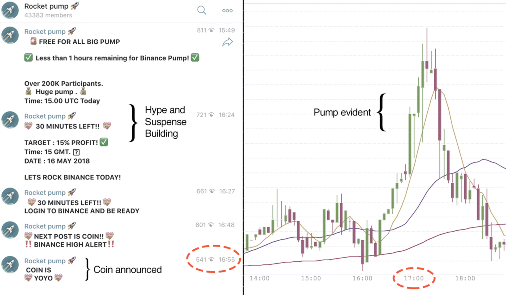
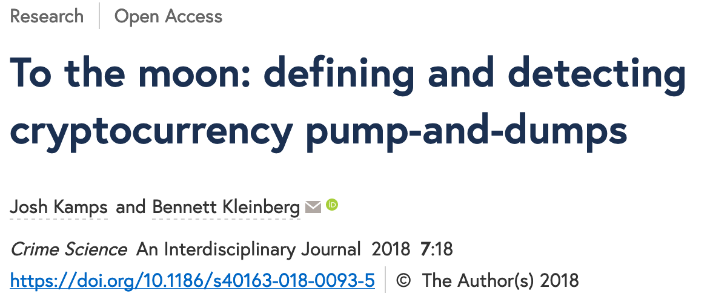

## {data-background="./ucl_artwork/ucl-banner-land-darkblue-rgb.png" data-background-size="70%" data-background-position="top" data-background-opacity="1"}

**Cryptocurrency fraude**

Bennett Kleinberg

Department of Security and Crime Science & Dawes Centre for Future Crime, University College London

## 
<!-- {data-background="./sharessinger.jpg" data-background-size="50%" data-background-position="center" data-background-opacity="1"} -->

##

## Anatomie van een P&D

<small>De drie fases van een pump-and-dump operatie [(Kamps & Kleinberg, 2018)](https://crimesciencejournal.biomedcentral.com/articles/10.1186/s40163-018-0093-5)</small>

## Twee gebeurtenissen

1. Het Internet
2. Cryptocurrencies

##

**What could go wrong?**

##

> The recent explosion of nearly 2,000 cryptocurrencies in a largely unregulated environment has greatly expanded the scope for abuse.

<small>[Hamrick et al., 2018](https://papers.ssrn.com/sol3/papers.cfm?abstract_id=3303365)</small>

##

### Het verhaal van [OfficialMcAfee](https://www.buzzfeednews.com/article/ryanmac/heres-how-scammers-are-using-fake-news-to-screw-with-bitcoin) en [OfficiallMcAfee](https://www.buzzfeednews.com/article/ryanmac/heres-how-scammers-are-using-fake-news-to-screw-with-bitcoin).

<small>bron: [Mac & Lytvynenko, Buzzfeed, 2018](https://www.buzzfeednews.com/article/ryanmac/heres-how-scammers-are-using-fake-news-to-screw-with-bitcoin)</small>

##

## Coin of the day ...

> When the tweet was first broadcast at around 3 p.m. ET, GVT was bought and sold on the market at $30.

##

> When the tweet was first broadcast at around 3 p.m. ET, GVT was bought and sold on the market at $30.

> By 3:04, it was at $45, and trading volume had doubled.

##

> When the tweet was first broadcast at around 3 p.m. ET, GVT was bought and sold on the market at $30.

> By 3:04, it was at $45, and trading volume had doubled.

> But by 3:19, GVT's price had fallen back to $30.29.

## Morale of the story

> But by 3:19, GVT's price had fallen back to $30.29.

> The smart money — the early money — had gotten out, leaving the late money holding a bag of now-diminished value.

## Crypto P&Ds

| Oude uitdagingen            	| Nieuwe uitdagingen                 	|
|------------------------------	|------------------------------------	|
| lage market cap             	| kortere tijd (bijna real-time) 	|
| gebrek aan informatie 	      | grotere verspreiding van misinformatie |
| zeer lage prijs              	| nieuwe vormen van geruchten        	|

## 

### Maar ja... dat is ook maar één probleem

<!-- cash analogy -->

##

- $50m (Onecoin)
- $825m over zes maanden
- $222m voor een groep
- prijs manipulatie tot [950%](https://cointelegraph.com/news/pump-and-dump-in-crypto-cases-measures-warnings)

## Het "grey zone" probleem

## 

### Kunnen we P&Ds detecteren?

## Data

- gescraped van cryptocurrency platforms
- transactie data met 1-uur resolutie
- 20 dagen transacties, 5 platforms, 977 transactie paren

<small>Data + code [https://osf.io/827wd/](https://osf.io/827wd/)</small>

## Criteria voor een P&D

- plots prijs stijging (PUMP)
- plots toename in volume (PUMP)
- duidelijke prijs drop (DUMP)

_Conditional local point anomaly detection_

## Anomalie parameters

|                   	| Balanced parameters 	|
|-------------------	|---------------------	|
| Estimation window 	| 12h                 	|
| Volume increase   	| 300%                	|
| Price increase    	| 5%                  	|
| Price drop        	| 1.00 SD             	|
| Alleged pumps     	| 2150                	|
| Pump-and-dumps    	| 1617                	|
| Crypto/crypto     	| 97.0%               	|
| Low market cap    	| 81.8%               	|

## P&D detectie

## Bevindingen

- **potentie for detectie**
- **voornamelijk crypto/crypto transacties**
- **voornamelijk lage market cap**

## Intermezzo: situational crime prevention

- weg van het crimonologisch-sociologisch model
- weg van het individualiserende model
- fraude/misdaad als complex probleem
- ... in situationele omstandigheden
- robuust effect: clustering

## Betekenis voor cryptocurrency

- begrijpen van _P&D situatie_
- is er sprake van clustering?

## Zooming in

- Platforms
    - % transacties $\neq$ % P&Ds
    - Somemige platforms zijn meer gebruikt dan anderen
    - bijv. "Kraken": 6% transacties, < 1% P&Ds
    - een van de meest gereguleerde marktplaatsen

## Zooming in

- Coins
    - Meeste coins nooit "slachtoffer"
    - Sommige coins zijn continu aangevallen
    - 30% coins $\sim$ 80% P&Ds

## Herhaaldelijke victimisatie van coins

## Hoofd bevindingen

- potentie voor detectie
- voornamelijk crypto/crypto transacties
- voornamelijk lage market cap
- **herhaaldelijke victimisatie van platforms**
- **herhaaldelijke victimisatie van coins**
- geen bewijs voor _"Bitcoin is not immune from the pump-and-dump phenomenon"_ (Hamrick et al., 2018)

## Misschien is er meer

- hoe kiezen de groepen "targets"?
- waat zijn de kosten-baten processen?

"High-potential coins and coin malleability"

[Kamps & Kleinberg, forthcoming]()

##

> Arguably, the decision to choose one coin for a pump-and-dump scheme and not another are not random but rather subject to cost-benefit processes.

> [...] if one is targeting a coin for a P&D, it is useful to be able to manipulate a coin’s price as much as possible, while using the least amount of capital

## Coin malleability

"the percentage price increase that a coin would experience, with respect to a certain amount of volume injected"

##

- data
    - 239 x/BTC paren
    - gescraped in April 2019
- BTC injecties van
    - 0.25 BTC (~ $1,300)
    - 1.00 BTC (~ $5,100)
    - 5.00 BTC (~ $25,500) 
    - 10.00 BTC (~ $51,000)

##

##

## Bevindingen voor coin malleability

_Not all coins are equal!_

- sommige coins zijn meer "malleable" dan anderen
- volume sterk geconcentreerd
- malleability is niet hetzelfde als een laag volume
- mogelijke verklaring: te laag volume _doesn't do the trick_!

## Real-world tests

## Wat is de bigger picture?

## Voorbeeld 1: Cryptojacking

## 

## Voorbeeld 2: Investment scams

Klassieke stappen:

- contactopname voor "unieke kans op een investering"
- criminelen doen zich voor als legitieme investeerders
- na investering is het geld weg

## Overgang naar cryptocurrencies

- toegang tot slachtoffers is veranderd (e.g. cold calls vs online)
- verificatie van details moeilijker
- meer tijdsdruk tot investering
- FCA schatting: [200m pond schade door cryptocurrency scams](https://www.fca.org.uk/news/press-releases/fca-warns-public-investment-scams-over-197-million-reported-losses-2018)

##

##

### Wat is de perceptie van cryptofraude?

## Scenario planning uitkomsten

- Fake crypto wallets 
- Crypto money mules
- Pump-and-dump schemes
- Investment scams
- Cryptojacking
- Bitcoin ATMs
- Cryptocurrencies transaction extortion
- Extortion with cryptocurrencies (ransomware)
- Transaction-based money laundering

## Hoe schadelijk zijn deze?

## Hoe profitabel zijn deze?

## Hoe "haalbaar" zijn deze?

## Hoe voorkombaar zijn deze?

## Problemen rondom de cryptospace?

## Drivers & inhibitoren?

## Drivers & inhibitoren?

##

##

> Maar hoezo maakt het uit? 

- crypto niet mainstream
- er zijn slachtoffers en _slachtoffers_
- er is helemaal geen fraude!

## Probleem van timing

- klassieke perspectief: reactief
- maar wat als je het andersom doet
- problemen anticiperen
- waardevol maar moeilijk te meten!

## Het "crypto is niet mainstream" probleem

Klopt!

Maar: het maken van mainstream gaat sneller dan gedacht

## 18 Juni 2019!!

## Facebook's LIBRA

### Visie op onderzoek & bigger picture

## Nieuwe problemen

- Twitter imitaties
- Veranderingen in verspreiding (kat - muis spel)
- Transacties in milliseconden

## Nieuwe vragen

- vertrouwen
    - hoe kiezen ze een leider?
    - hoe behouden ze intern vertrouwen?
    - hoe wordt gestraft?

## Nieuwe vragen

- vertrouwen
- groep-dynamiek
    - hoe loopt de recruitment?
    - hoe maak je carriere?

## Visie op toekomstig onderzoek

Realistisch: ground truth data + detectie

1. samenwerking tussen universiteiten en fintech, overheid, banken, "citizen science"

##

## Visie op toekomstig onderzoek

Realistisch: ground truth data + detectie

1. samenwerking tussen universiteiten en fintech, overheid, banken, "citizen science"
2. infiltratie van groepen
3. eigen P&D

## Zijn cryptocurrencies de toekomst van fraude?

Ja ~~Misschien~~ ~~Nee~~

## Einde.

Promovendi + post-docs: Josh Kamps, Florian Hetzel, Eray Akartuna

<small>bennett.kleinberg@ucl.ac.uk // [bkleinberg.net](https://bkleinberg.net/)</small>

-------

