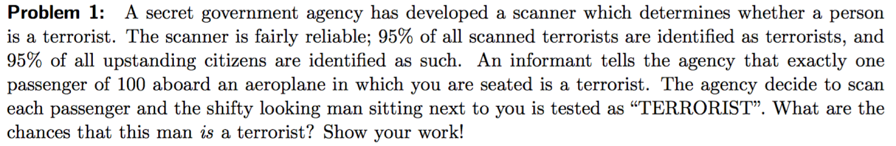
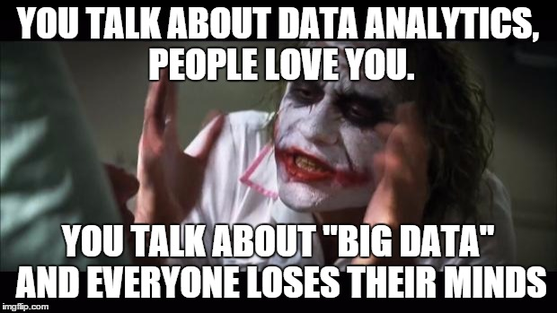
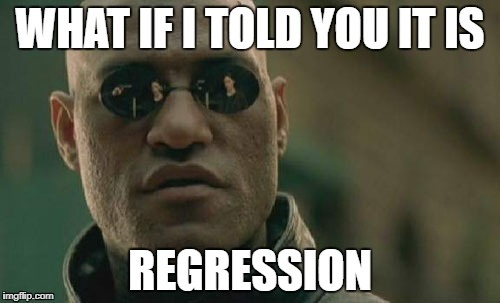
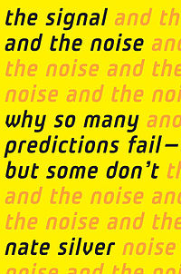

##  {data-background="./img/ucl_artwork/ucl-banner-land-darkblue-rgb.png" data-background-size="70%" data-background-position="top" data-background-opacity="1"}


## Today {.left_aligned}

- The big promise: A primer of data science
- The pitfalls and problems
- Data Science for security

<small>(if we have time: The do-or-die problem of data science)</small>


## Your thoughts? {.left_aligned}

1. More data = better problem solving.
2. Every problem will become a "data problem".
3. The big challenge for data science is a technological one.


## Aaah: so we're talking Big Data!


## Problems with "Big Data"

- what is "big"?
- data = data?
- complexity of data?
- sexiness of small data

## Before we start

What are the chances that this man is a terrorist?



##

### The big promise: A primer of data science

## Machine learning? {.left_aligned}

- core idea: a system learns from experience
- no precise instructions

Applications?

## Why do we want this?

Step back...

How did you perform regression analysis in school?

## Okay ...

- you've got one outcome variable (e.g. number of shooting victims)
- and two predictors (e.g. gender of shooter, age)
- typical approach $victims = gender + age$
- regression equation with: intercept, beta coefficients and inferred error term


## But!

Often we have no idea about the relationships.

- too many predictors
- too diverse a problem
- simply unknown

## ML in general

- concered with patterns in data
- learning from data
- more experience results typically in better models
- data, data, data

##

### Types of machine learning

## Broad categories

- **Supervised learning**
- **Unsupervised learning**
- Hybrid models
- Deep learning
- Reinforcement learning

## Deep learning

Inspired by the human brain.

- MIT's course website [https://deeplearning.mit.edu/](https://deeplearning.mit.edu/)
- Lex Fridman's courses from MIT --> [YouTube](https://www.youtube.com/watch?v=O5xeyoRL95U)

## Reinforcement learning

- Excellent YouTube examples from [code bullet](https://www.youtube.com/watch?v=Yo2SepcNyw4)
- e.g. [AI Learns to play the Worlds Hardest Game](https://www.youtube.com/watch?v=Yo2SepcNyw4)

[Demo](https://code-bullet.github.io/WorldsHardestGameAI/WHG%20-%20level2/)

## 

### SUPERVISED LEARNING

## What is supervised?

- who is the supervisor?
- supervised = labelled data
- i.e. you know the outcome
- flipped logic

Contrary: unsupervised.

## Classes of supervised learning

- classification (e.g. death/alive, fake/real)
- regression (e.g. income, number of deaths)

## Mini example

_Supervised classification_

```{r echo=F}
set.seed(123457)
data1 = data.frame(gender = rep(c('male', 'female'), each=10)
                   , salary = round(c(rnorm(10, 35000, 5000), rnorm(10, 25000, 10000)), 0))
```


## Simple example

- gender prediction 
- based on salary

```{r echo=F}
knitr::kable(data1[c(1:4, 11:14),], col.names = c('gender', 'salary'), row.names = F)
```

##

```{r echo=F}
data2 = data1[sample(1:20, 20), ]
{plot(data2$salary, col=data2$gender)}
```

## 

How to best separate the data into two groups?

## Core idea

- learn relationship between
    - outcome (target) variable
    - features (predictors)
- "learning" is done through an algorithm
    - simplest algorithm: `if A then B`

## Idea 1: male salary threshold

```{r echo=F}
{plot(data1$salary, col=data1$gender)
  abline(v=10)
  abline(h=min(data1$salary[data1$gender == 'male']), col='blue', lty=2)}
```

## Idea 1: male salary threshold

```{r echo=F}
minimum_male = min(data1$salary[data1$gender == 'male'])
data1$my_prediction = ifelse(data1$salary >= minimum_male, 'male', 'female')
```

```{r echo=F}
{plot(data1$salary, col=as.factor(data1$my_prediction)
      , main = "ifelse(data1$salary >= minimum_male, 'male', 'female')")
  abline(v=10)
  abline(h=min(data1$salary[data1$gender == 'male']), col='blue', lty=2)}
```

## Idea 2: female salary threshold

```{r echo=F}
{plot(data1$salary, col=data1$gender)
  abline(v=10)
  abline(h=max(data1$salary[data1$gender == 'female']), col='blue', lty=4)}
```


## Idea 2: female salary threshold

```{r echo=F}
maximum_female = max(data1$salary[data1$gender == 'female']) #41682
data1$my_prediction2 = ifelse(data1$salary <= maximum_female, 'female', 'male')
```

```{r echo=F}
{plot(data1$salary, col=as.factor(data1$my_prediction2)
      , main = "ifelse(data1$salary <= maximum_female, 'female', 'male')")
  abline(v=10)
  abline(h=max(data1$salary[data1$gender == 'female']), col='blue', lty=4)}
```

##

But this is not learning!

## Stepwise supervised ML

- clarify what `outcome` and `features` are
- determine which classification algorithm to use
- train the model

## Enter: `caret`

```{r message=F}
library(caret)
```

- excellent package for ML in R
- well-documented [website](https://topepo.github.io/caret/index.html)
- common interface for [200+ models](https://topepo.github.io/caret/available-models.html)

## `caret` in practice


```{r echo=F}
set.seed(123457)
data2 = data.frame(gender = rep(c('male', 'female'), each=10)
                   , salary = round(c(rnorm(10, 35000, 5000), rnorm(10, 25000, 10000)), 0)
                   , height = round(c(rnorm(10, 178, 15), rnorm(10, 165, 15)), 0))
plot(data2$salary, data2$height, col=data2$gender, main="Real gender")
```

## `caret` in practice

```{r}
my_first_model = train(gender ~ .
                       , data = data2
                       , method = "svmLinear"
                       )
```

Now you have trained a model!

= you have taught an algorithm to learn to predict gender from salary & height

##


But now what?

## Put your model to use

Make predictions:

```{r}
data2$model_predictions = predict(my_first_model, data2)
```

```{r echo=F}
knitr::kable(table(data2$gender, data2$model_predictions))
```

##

```{r echo=F}
plot(data2$salary, data2$height, col=data2$model_predictions, main="Algorithm-predicted gender")
```

##

```{r echo=F}
library(e1071)
set.seed(123456)
data3 = data.frame(gender = rep(c('male', 'female'), each=10)
                   , salary = round(c(rnorm(10, 35000, 5000), rnorm(10, 25000, 10000)), 0)
                   , height = round(c(rnorm(10, 178, 15), rnorm(10, 165, 15)), 0))
m1 = svm(gender~., data=data3)
plot(m1, data3, svSymbol = 2, dataSymbol = 2)
```

##

### The key challenge?

Think about what we did...

## Problem of inductive bias

- remember: we learn from the data
- but what we really want to know is: how does it work on **"unseen"** data

How to solve this?

## Keep some data for yourself

Train/test split

- split the data (e.g. 80%/20%, 60%/40%)
- use one part as TRAINING SET
- use the other as TEST SET


```{r echo=F}
set.seed(123456)
data2 = data.frame(gender = rep(c('male', 'female'), each=10)
                   , salary = round(c(rnorm(10, 35000, 5000), rnorm(10, 25000, 10000)), 0)
                   , height = round(c(rnorm(10, 178, 15), rnorm(10, 165, 15)), 0))

set.seed(1)
in_training = createDataPartition(y = data1$gender
                                  , p = .8
                                  , list = FALSE
                                  )
```

##

```{r}
training_data = data2[ in_training,]
test_data = data2[-in_training,]
```

```{r echo=F}
knitr::kable(test_data)
```


## Pipeline again

- define outcome (DONE)
- define features (DONE)
- build model (DONE)
    - but this time: on the TRAINING SET
- evaluate model
    - this time: on the TEST SET
    
##

Teach the SVM:

```{r}
my_second_model = train(gender ~ .
                       , data = training_data
                       , method = "svmLinear"
                       )
```

Fit/test the SVM:

```{r}
model_predictions = predict(my_second_model, test_data)
```

```{r echo=F}
knitr::kable(table(test_data$gender, model_predictions))
```

## But!

- our model might be really dependent on the training data
- we want to be more careful
- Can we do some kind of safeguarding in the training data?

## Cross-validation

K-fold cross-validation


<small>[Img source](https://my.oschina.net/Bettyty/blog/751627)</small>

## 

### How do we know whether a model is good?

## Model performance metrics

<!-- ```{r echo=F} -->
<!-- knitr::kable(table(test_data$outcome, model_1.predictions)) -->
<!-- ``` -->

Example: 400 fake/real news articles:

|         	|      	| Prediction 	|      	|
|---------	|------	|------------	|------	|
|         	|      	| Fake       	| Real 	|
| Reality 	| Fake 	| 159        	| 41   	|
|         	| Real 	| 42         	| 158  	|

How do you evaluate that model?

<p class='fragment'>_(159+158)/400 = 0.73_</p>

## Intermezzo

### The confusion matrix

## Confusion matrix

|            |    Fake|    Real|
|:------|-------:|-------:|
|Fake   | <span class="fragment" data-fragment-index="1">True positives</span>| <span class="fragment" data-fragment-index="4">False negatives</span>| 
|Real   | <span class="fragment" data-fragment-index="3">False positives</span>| <span class="fragment" data-fragment-index="2">True negatives</span>|

## Confusion matrix

- true positives (TP): correctly identified fake ones
- true negatives (TN): correctly identified real ones
- false positives (FP): false accusations
- false negatives (FN): missed fakes

## OKAY: let's use accuracies

$acc=\frac{(TP+TN)}{N}$

Any problems with that?

## Accuracy

```{r echo=F}
m1 = array(c(252, 80, 48, 220), dim=c(2,2))
dimnames(m1) = list(reality = c('Fake', 'Real')
                       , prediction = c('Fake', 'Real'))
knitr::kable(m1, caption = 'Model 1')
```

```{r echo=F}
m2 = array(c(290, 118, 10, 182), dim=c(2,2))
dimnames(m2) = list(reality = c('Fake', 'Real')
                       , prediction = c('Fake', 'Real'))
knitr::kable(m2, caption = 'Model 2')
```

## Problem with accuracy

- same accuracy, different confusion matrix
- relies on thresholding idea
- not suitable for comparing models (don't be fooled by the literature!!)

Needed: more nuanced metrics

## The problem from the beginning:

What are the chances that this man is a terrorist?


## Formalising the problem

Probability of TERRORIST **given** that there is an ALARM

</br>

Looking for: `P(terrorist GIVEN alarm)`

Formal: `P(terrorist|alarm)`

## Solving the problem

|   |  Terrorist | Passenger |
--- | --- | --- | --- | --- |
Terrorist | <span class="fragment" data-fragment-index="5">950</span> | <span class="fragment" data-fragment-index="5">50</span> | <span class="fragment" data-fragment-index="2">1,000</span>
Passenger | <span class="fragment" data-fragment-index="4">4,950</span> | <span class="fragment" data-fragment-index="4">94,050</span> | <span class="fragment" data-fragment-index="3">99,000</span>
|   | <span class="fragment">5,900</span> | <span class="fragment">94,100</span> | <span class="fragment" data-fragment-index="1">100,000</span>

<span class="fragment">`P(terrorist|alarm) = 950/5900 = 16.10%`</span>


## Beyond accuracy

```{r echo=F}
addmargins(m1, c(1,2))
```

```{r echo=F}
addmargins(m2, c(1,2))
```


## Precision

How often is the prediction correct when predicting class _X_?

Note: we have two classes, so we get _two_ precision values

Formally: 

- $Pr_{fake} = \frac{TP}{(TP+FP)}$
- $Pr_{real} = \frac{TN}{(TN+FN)}$


## Precision

```{r echo=F}
addmargins(m1, c(1,2))
```

- $Pr_{fake} = \frac{252}{332} = 0.76$
- $Pr_{real} = \frac{220}{268} = 0.82$


## Comparing the models

|            |       Model 1|       Model 2|
|:-----------|-------------:|-------------:|
|$acc$       |          0.79|          0.79|
|$Pr_{fake}$ |          0.76|          0.71|
|$Pr_{real}$ |          0.82|          0.95|

## Recall

How many cases of class _X_ are detected?

Note: we have two classes, so we get _two_ recall values

Also called sensitivity and specificity!

Formally: 

- $R_{fake} = \frac{TP}{(TP+FN)}$
- $R_{real} = \frac{TN}{(TN+FP)}$

## Recall

```{r echo=F}
addmargins(m1, c(1,2))
```

- $R_{fake} = \frac{252}{300} = 0.84$
- $R_{real} = \frac{220}{300} = 0.73$

## Comparing the models

|            |       Model 1|       Model 2|
|:-----------|-------------:|-------------:|
|$acc$       |          0.79|          0.79|
|$Pr_{fake}$ |          0.76|          0.71|
|$Pr_{real}$ |          0.82|          0.95|
|$R_{fake}$  |          0.84|          0.97|
|$R_{real}$  |          0.73|          0.61|

## Combining Pr and R

The _F1_ measure.

Note: we combine Pr and R for each class, so we get _two_ F1 measures.

Formally: 

- $F1_{fake} = 2*\frac{Pr_{fake} * R_{fake}}{Pr_{fake} + R_{fake}}$
- $F1_{real} = 2*\frac{Pr_{real} * R_{real}}{Pr_{real} + R_{real}}$

## F1 measure

```{r echo=F}
addmargins(m1, c(1,2))
```

- $F1_{fake} = 2*\frac{0.76 * 0.84}{0.76 + 0.84} = 2*\frac{0.64}{1.60} = 0.80$
- $F1_{real} = 2*\frac{0.82 * 0.73}{0.82 + 0.73} = 0.78$

## Comparing the models

|            |       Model 1|       Model 2|
|:-----------|-------------:|-------------:|
|$acc$       |          0.79|          0.79|
|$Pr_{fake}$ |          0.76|          0.71|
|$Pr_{real}$ |          0.82|          0.95|
|$R_{fake}$  |          0.84|          0.97|
|$R_{real}$  |          0.73|          0.61|
|$F1_{fake}$ |          0.80|          0.82|
|$F1_{real}$ |          0.78|          0.74|


## 

### UNSUPERVISED LEARNING

##

- often we don't have labelled data
- sometimes there are no labels at all
- core idea: finding clusters in the data

```{r message=F, echo=F}
library(caret)
```

## Examples

- grouping of online ads
- clusters in crime descriptions
- ...

Practically everywhere. 

Clustering reduces your data!

## 

```{r echo=F}
set.seed(123456)
data2 = data.frame(gender = rep(c('male', 'female'), each=300)
                   , salary = round(c(rnorm(300, 38000, 4000), rnorm(300, 25000, 8000)), 0)
                   , height = round(c(rnorm(300, 180, 10), rnorm(300, 165, 10)), 0))
{plot(data2$salary, data2$height, col=data2$gender)
  legend("topleft" 
  , legend = c("Male", "Female")
  , col = c('red', 'black')
  , pch = c(1))}
```

## The unsupervised case

You know nothing about groups inherent to the data.

```{r echo=F}
data3 = data2
data3$salary = scale(data2$salary)
data3$height = scale(data2$height)
plot(data3$salary, data3$height, ylim=c(-3, 3), xlim=c(-3,3))
data4 = data3[, 2:3]
```

## The k-means idea

- separate data in set number of clusters
- find best cluster assignment of observations

## Stepwise

1. set the number of clusters
2. find best cluster assignment

## 1. no. of clusters

Let's take 4.

```{r}
unsup_model_1 = kmeans(data4
                       , centers = 4
                       , nstart = 10
                       , iter.max = 10)
```

## What's inside?

```{r echo=F, warning=F, message=F}
c1 = kmeans(data4, centers = 4, iter.max = 1)
c2 = kmeans(data4, centers = c1$centers, iter.max = 1)

{plot(data4$salary, data4$height, col=c1$cluster, pch=16, main="Iteration: 1")
points(c1$centers, col=1:4,pch=4,cex=3, lwd=4)}
```

##

```{r echo=F}
{plot(data4$salary, data4$height, col=c2$cluster, pch=16, main="Iteration: 2")
points(c2$centers, col=1:4,pch=4,cex=3, lwd=4)}
```


##

```{r message=F, echo=F}
library(factoextra)
fviz_cluster(unsup_model_1, geom = "point", data = data4)
```

## The k-means algorithm

- find random centers
- assign each observation to its closest center
- optimise for the WSS

## 

### What's problematic here?

## But how do we know how many centers?

Possible approach: 

- run it for several combinations
- assess the WSS
- determine based on scree-plot

## Cluster determination

```{r}
wss = numeric()
for(i in 1:20){
  kmeans_model = kmeans(data4, centers = i, iter.max = 20, nstart = 10)
  wss[i] = kmeans_model$tot.withinss
}
```


## Scree plot (elbow method)

Look for the inflexion point at center size _i_.

```{r echo=F}
plot(1:20, wss, type='b')
```

## Other methods to establish _k_

- Silhoutte method (cluster fit)
- Gap statistic

See also [this](https://uc-r.github.io/kmeans_clustering) tutorial.


## Choosing _k_

We settle for $k = 2$

```{r}
unsup_model_final = kmeans(data4
                       , centers = 2
                       , nstart = 10
                       , iter.max = 10)
```


## Plot the cluster assignment

```{r echo=F}
fviz_cluster(unsup_model_final, geom = "point", data = data4)
```

## Other unsupervised methods

- k-means (today)
- hierarchical clustering
- density clustering

## Issues with unsupervised learning

What's lacking?

What can you (not) say?

## Caveats of unsup. ML

- there is no "ground truth"
- interpretation/subjectivity
- cluster choice

## Interpretation of findings

```{r echo=F}
fviz_cluster(unsup_model_final, geom = "point", data = data4)
```

## Interpretation of findings

```{r}
unsup_model_final$centers
```

- Cluster 1: low salary, small
- Cluster 2: high salary, tall

Note: we cannot say anything about accuracy.

See the [k-NN model](https://www.datacamp.com/community/tutorials/machine-learning-in-r#six).

## Interpretation of findings

- subjective
- labelling tricky
- researchers choice!
- be open about this

##

##

### Pitfalls and problems


## Bias

Remember supervised learning?

What is the essential characteristic of it?

## Suppose ... 

... you have to predict the quality of song lyrics.

How would you do it?

## Examples

- quality of a football match
- attractiveness of an area
- quality of your degree

## Bias through labelled data

- machine learning is only the tool!
- supervised learning will always predict something
- you need the researcher's/analyst's mindset to interpret it

Basic principle: BS in = BS out.

## Problematic trends



## Problematic trends



## Problematic trends


## Problematic trends

Assumptions, assumptions, assumptions, assumptions, assumptions, assumptions, assumptions, assumptions, assumptions, assumptions, assumptions, assumptions, assumptions, assumptions, assumptions, assumptions, assumptions, assumptions, assumptions. Everywhere assumptions.

## The naivité fallacy


## The naivité fallacy


<small>[source](https://nakedsecurity.sophos.com/2018/02/14/new-ai-technology-used-by-uk-government-to-fight-extremist-content/)</small>

## The naivité fallacy


## The naivité fallacy

**Put simply:** you can sell anything.

## Here's an idea

```{r eval=F}
ai_terrorism_detection = function(person){
  person_classification = 'no terrorist'
  return(person_classification)
}
```

<p class="fragment">"UCL RESEARCHERS USE AI TO FIGHT TERRORISM!"</p>

<p class="fragment">"AI 99.9999% ACCURATE IN SPOTTING TERRORISTS!"</p>


## The category mistake of data science

[https://www.youtube.com/watch?v=fCLI6kxFFTE](https://www.youtube.com/watch?v=fCLI6kxFFTE)

## Category mistake

- So we are getting there with self-driving cars.
- Hence: we can also address the other challenges.

!!!!

## Category mistake


<small>[Geller, 1999](https://www.nature.com/nature/debates/earthquake/equake_1.html), [538 article](https://fivethirtyeight.com/features/we-still-cant-predict-earthquakes/) </small>


## 

> "I would not be at all surprised if earthquakes are just practically, inherently unpredictable."

[(Ned Field)](https://www.usgs.gov/staff-profiles/ned-field?qt-staff_profile_science_products=0#qt-staff_profile_science_products)


## Category mistake

- Building a sophisticated visual recogntion system != predicting everything
- Static phenomena vs. complex systems


_Human behaviour might be the ultimate frontier in prediction._


## Ethical issues

- data sources
- (machine) learning systems
- reinforcing systems
- responsible practices

## Ethics & data science

Your turn: do you see problems for these aspects?

- data sources
- (machine) learning systems

## Ethics & data science

What about "reinforcing systems"?

## Ethics & data science

Choose 1:

1. FP/FN issue in the hand of practitioners
2. academics' responsibility

## An outlook

What would an ideal Data Science look like?

## Be specific...

Academic data science

vs

"Industry" data science

**Question: which one is leading?**

##

**Extreme view:** 

current academic data science is catering hype to compensate the Google envy.

##


## Academic data science

| What it is doing | What it should be doing |
| ---------------- | ------------------------|
| creating "cool" studies | testing assumptions |
| pumping out non-reproducible papers | investing in fundamental data science research |
| hiring people to do cool things with our data | starting with the problem |
| getting on the data science train | focus on methods of data science |

## Outlook

- we need *boring* studies!
    - longitudinal studies
    - assumption checks
    - replications
- we need to accept that Google & Co. are a different league in applying things
- we need to focus on the "ACADEMIC" part
- we need unis as control mechanism, not as a player

##

### Data science for security

##

Where can data science help?

## Using data science

1. Automating human work
2. Exceeding human capacity
3. Augmenting human decision-making

## Automating human work

Examples:

- scanning images for guns
- moderating content on social media
- access control to buildings

## Automating human work

Why?

- reliability
- costs per unit
- scalability


## Exceeding human capacity

Examples:

- remote sensing applications
- deception detection
- tumor detection

## Exceeding human capacity

Why?

- processing capacity problem
- complex relationships
- limited attention of humans

## Augmenting human decision-making

Human-in-the-loop systems:

1. ML system makes a decision
2. Human revises the decision
3. Final decision reached

## Augmenting human decision-making

Why?

- uses best of both worlds
- context (human) + scale (machine)
- allows your system to gain traction

##

### The biggest problem for data science

## 

### **Everything is matter**

## 

### **Everything can be measured**

## 

### **Everything can be represented in data**

## 


### Pep the super data scientist

## Pep the super data scientist

- knows everything about football
    - knows what happens if you hit a ball from angle X from distance Y at speed Z, etc.
    - knows everything about the physiology of the players, about the physical properties of the ball, about the rules
- has got access to all the data that you can possibly collect from a football game 

## 

But: 

- Pep experiences the world from an isolated room...
- ... through his python editor...
- ... and only has access to the data

_… and never saw a football match._

## 

- Put differently: Pep knows everything about football but has never experienced it
- Pep is thrilled by Cristiano Ronaldo and Lionel Messi
- And has all their data

<small>(Adaptation from [The Knowledge Argument / Mary's Room by Frank Jackson](https://en.wikipedia.org/wiki/Knowledge_argument), 1982)</small>


## One day ...

One day, Pep goes out to the ”real” world and watches a match between Juventus (C. Ronaldo) and Barca (Messi).

**Will Pep learn anything?**


## What does this mean?

- Qualia problem
- Originates from the philosophy of mind (consciousness problem)
- But reaches far beyond that

## Pep's problem & security

- perception of security
- experience of security
- perception of fairness

##

## Recap

1. Fastest intro to ML
2. Some problems and pitfalls of data science
3. Possible applications in security problems
4. The hard problem of data science

##

If you only read one book in 2019...

Read: "The Signal and the noise", Nate Silver




##

### Questions?