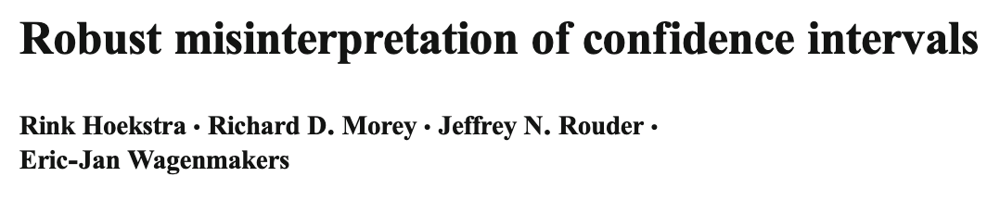
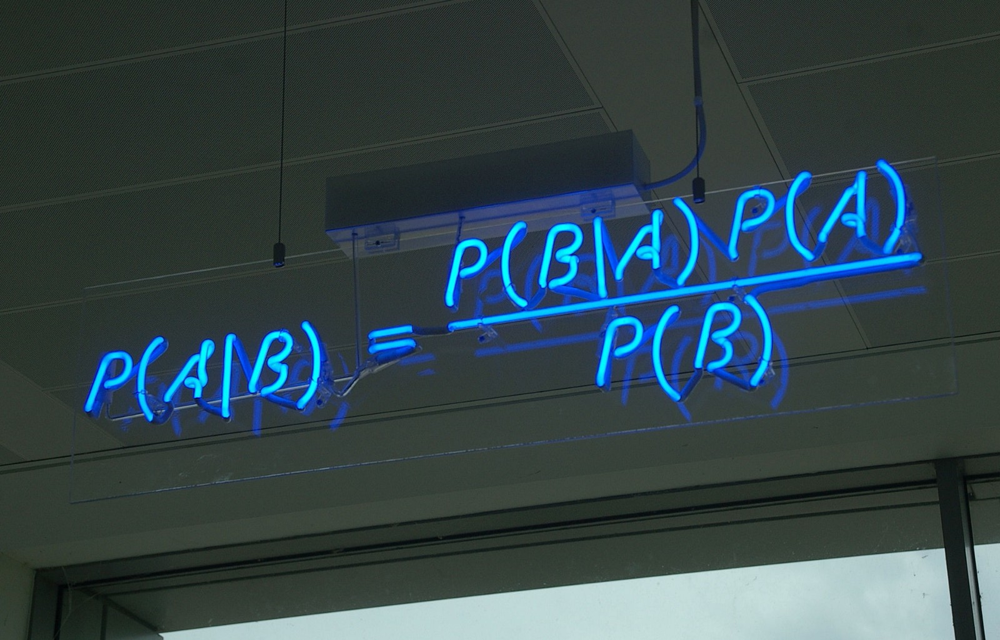
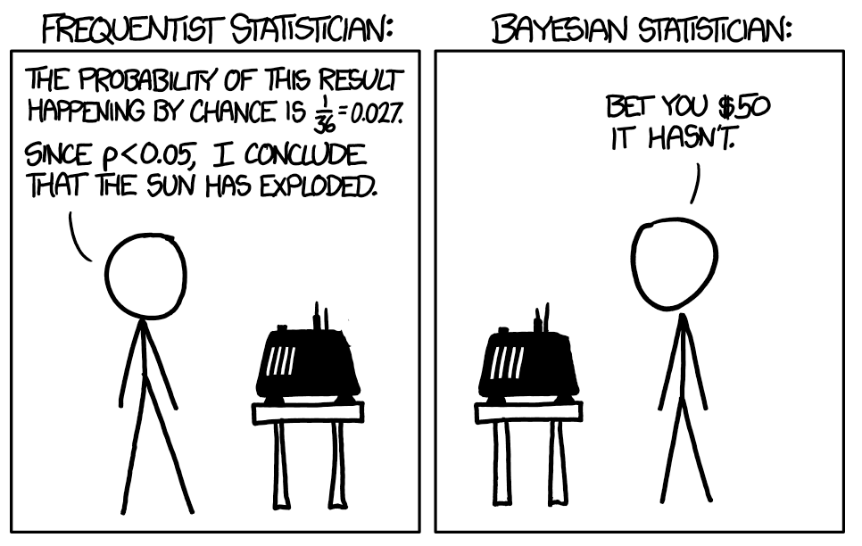
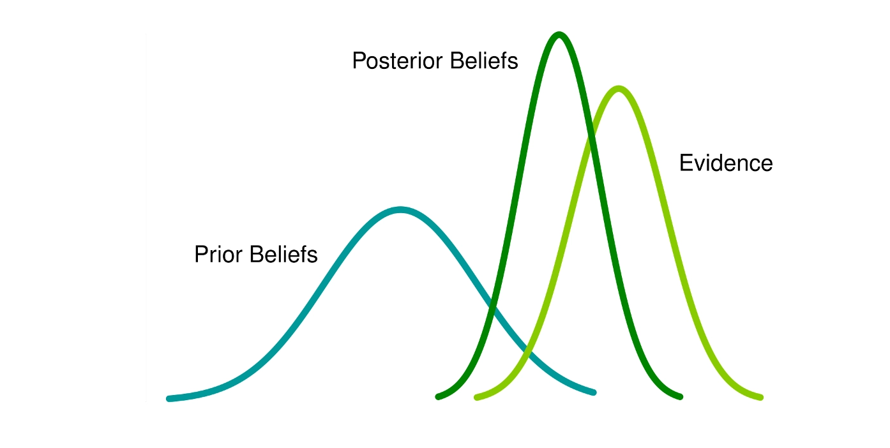
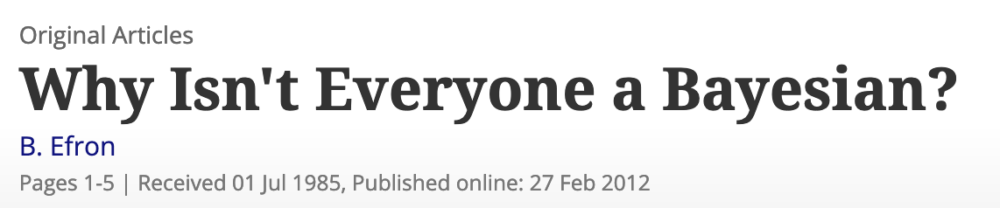
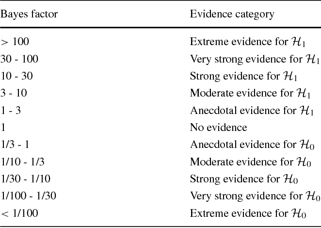
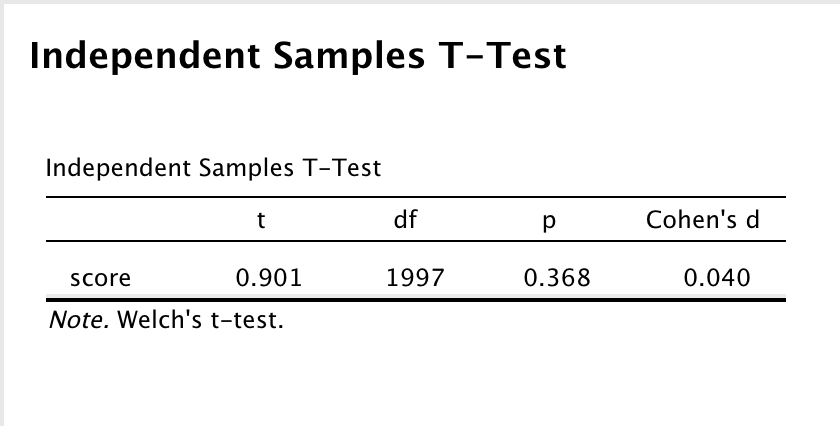
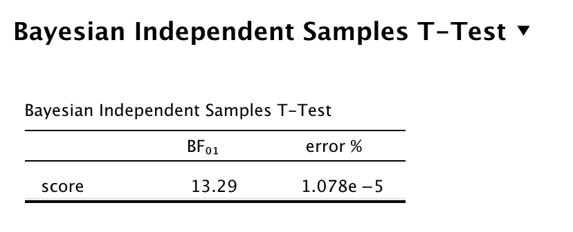
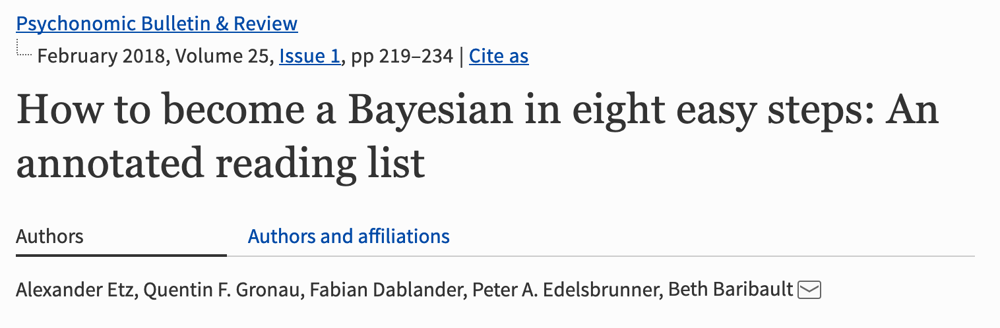

## {data-background="./img/ucl_artwork/ucl-banner-land-yellow-rgb.png" data-background-size="70%" data-background-position="top" data-background-opacity="1"}

### Bayesian hypothesis testing

## Screening terrorists


## **Your turn**

What are the chances that this man is a terrorist?


## Formalising the problem

CONDITIONAL Probability:

</br>

Probability of TERRORIST **given** that there is an ALARM

</br>

Looking for: `P(terrorist GIVEN alarm)`

Formal: `P(terrorist|alarm)`

## Solving the problem (method 1)

|   |  Terrorist | Passenger |
--- | --- | --- | --- | --- |
Terrorist | <span class="fragment" data-fragment-index="5">950</span> | <span class="fragment" data-fragment-index="5">50</span> | <span class="fragment" data-fragment-index="2">1,000</span>
Passenger | <span class="fragment" data-fragment-index="4">4,950</span> | <span class="fragment" data-fragment-index="4">94,050</span> | <span class="fragment" data-fragment-index="3">99,000</span>
|   | <span class="fragment">5,900</span> | <span class="fragment">94,100</span> | <span class="fragment" data-fragment-index="1">100,000</span>

<span class="fragment">`P(terrorist|alarm) = 950/5900 = 16.10%`</span>

## Method 2: Bayes' rule

Setting the stage:

- P(T) -> probability of terrorist
- P(A) -> probability of alarm

We want:

- P(T|A)

We know:

- accuracy = P(A|T) = 0.95
- baserate = P(T) = 0.01

## Bayes' rule

```{r}
accuracy = 0.95 #P(A|T)
baserate = 0.01 #P(T)
```

Bayes' rule: `P(T|A) = ( P(A|T) * P(T) ) / P(A)`

P(A) --> probability of any alarm???

##

`P(A) = P(A|T) * P(T) + P(A|notT) * P(notT)`

```{r}
(Prob_notT = 1 - baserate) #P(notT) = 1 - P(T)
(Prob_A_given_notT = 1 - accuracy) #P(A|notT) = 1 = P(A|T)
```


## Bayes' rule (cont'd)

Putting it together:

```{r}
#Bayes' rule:
Prob_A = accuracy * baserate + Prob_A_given_notT * Prob_notT #P(A) = P(A|T) * P(T) + P(A|notT) * P(notT)
Prob_A
```

```{r}
Prob_T_given_A = (accuracy * baserate) / Prob_A #P(T|A) = ( P(A|T) * P(T) ) / P(A)
Prob_T_given_A
```

##

##

### Bigger picture: why all this?

## Suppose:

- you have two groups (left-handed vs right-handed)
- you take their IQ score
- you want to test if one group has a higher IQ score than the other

How would you do it?

## Rewind

Null hypothesis significance testing (NHST)

## Hypothesis testing the old way

```{r echo=F}
set.seed(123)
group_a = rnorm(1000, 101, 15)
group_b = rnorm(1000, 100, 15)

{plot(group_a, col='red', ylab='Score')
points(group_b, col='blue')}
```

## Hypothesis testing the old way

```{r echo=F}
{plot(density(group_a), col='red', main='')
  lines(density(group_b), col='blue')}
```

## Hypothesis testing the old way

**NULL** hypothesis testing

- $H_0$ : $M_A \approx M_B$ 
    - there is no difference in the means between Group A and Group B
    
- $H_A$ : $M_A \neq M_B$
    - there is a difference in the means between Group A and Group B
    - Directed hypotheses:
        - $H_A$ : $M_A > M_B$
        - $H_A$ : $M_A < M_B$
  
## Hypothesis testing the old way

Purpose:

- test whether the data allow us to reject $H_0$
- remember: rejecting $H_0$ $\neq$ accepting $H_A$
- remember: not rejecting $H_0$ $\neq$ $M_A == M_B$
- [obsession with the _p_-value](https://www.intechopen.com/books/bayesian-inference/bayesian-hypothesis-testing-an-alternative-to-null-hypothesis-significance-testing-nhst-in-psycholog)

In fact: _all we can ever say_ is whether $H_0$ was rejected or not!

## Today

Bayesian statistics

- What is it?
- How does it differ from NHST?
- What can it solve?
- Why should I care?
- How do I do it?

## There are more problems

- we're bad at interpreting NHST results (e.g. p-values, [CIs](https://www.ejwagenmakers.com/inpress/HoekstraEtAlPBR.pdf))
- strong assumptions about the data
- no stopping rule (increase _n_ and everything becomes significant)

## Quite problematic

> The misunderstandings surrounding p-values and CIs are particularly unfortunate because they constitute the main tools by which ~~psychologists~~ _crime scientists_ draw conclusions from data.



## Why do we need hypothesis testing anyway?

- core of inference testing
- core of scientific endeavour
    - think of the 'reproducibility crisis'
    - we want to avoid fishing expeditions
    
So: we deseperately need hypotheses, but NHST is weak

## Enter



## Two ideas of probability:

**Frequentist vs Bayesian**

## Laymen's explanation

I have misplaced my phone somewhere in the home. I can use the phone locator on the base of the instrument to locate the phone and when I press the phone locator the phone starts beeping.

Problem: Which area of my home should I search?

<small>Adapted from [this SO post](https://stats.stackexchange.com/questions/22/bayesian-and-frequentist-reasoning-in-plain-english)</small>

## Frequentist Reasoning

> I can hear the phone beeping. I also have a mental model which helps me identify the area from which the sound is coming. Therefore, upon hearing the beep, I infer the area of my home I must search to locate the phone.

## Bayesian Reasoning

> I can hear the phone beeping. Now, apart from a mental model which helps me identify the area from which the sound is coming from, I also know the locations where I have misplaced the phone in the past. So, I combine my inferences using the beeps and my prior information about the locations I have misplaced the phone in the past to identify an area I must search to locate the phone.

##


<small>[Img source](https://xkcd.com/1132/)</small>

##




## What is all this?

Remember?

$P(A|B) = \frac{P(B|A)*P(A)}{P(B)}$

$P(terrorist|alarm) = \frac{P(alarm|terrorist)*P(terrorist)}{P(alarm)}$

## Translated to hypothesis testing

- $P(H)$ : prob. of hypothesis _H_ **prior** to have seen the data
- $P(D)$ : marginal prob. of the data (same for all hyp.)
- $P(D|H)$ : compatibility of the data with the hyp. (**likelihood**)

We want to know: 

$P(H|D)$ : prob. of the hyp. given the data (**posterior**)

##

$P(H|D) = \frac{P(D|H)*P(H)}{P(D)}$

</br></br>

$posterior = \frac{likelihood*prior}{marginal}$


## Formally

Since: $P(D)$ does not involve the hypothesis, ...

$P(H|D) \propto P(D|H)*P(H)$

## Conceptually

$posterior \propto likelihood*prior$

- posterior: what we know after having seen the data (i.e. **what we learned from the data**)
- prior: our _prior_ beliefs
- likelhood: observation


## Think for a second

- this means that evidence can/must convince
- if you know that the sun is unlikely to have exploded, the evidence must be very, very strong to convince you otherwise

##

**Bayesian inference is about updating beliefs with the data.**



## Bayesian hypothesis testing

If for any _H_:

$P(H|D) \propto P(D|H)*P(H)$

... then maybe we can compare the evidence $P(H_0|D)$ with the evidence $P(H_A|D)$?


## Bayesian hypothesis testing

Suppose we have not seen the data, then:

$odds_{0A} = \frac{P(H_0)}{P(H_A)}$

or:

$odds_{prior} = \frac{prior_{H_0}}{prior_{H_A}}$

**Important:** no special status for $H_0$!

## Bayesian hypothesis testing

What we need for two hypotheses $H_0$ and $H_A$ is:

- $P(D|H_A)$ : compatibility of the data with $H_A$
- ... versus ...
- $P(D|H_0)$ : compatibility of the data with $H_0$

## The Bayes factor

$\frac{P(H_A|D)}{P(H_0|D)} = \frac{P(D|H_A)}{P(D|H_0)}*\frac{P(H_A)}{P(H_0)}$

How much more likely the data are under $H_A$ compared to $H_0$.

Called the Bayes Factor $BF_{A0}$

##

>The evidence in the data favors one hypothesis, relative to another, exactly to the degree that the hypothesis predicts the observed data better than the other.

[What is a Bayes factor? (Morey, 2014)](https://richarddmorey.org/2014/02/what-is-a-bayes-factor/)

## Stepwise example

Suppose we have two lines of thought re. successful replication of crime science research:

- Optimists
- Skeptics

Optimists say that 65% of research replicates; skeptics say it's 40%.

##

Data: 100 replications and their outcome (successful vs fail)

- $H_{optimists} = 0.65$
- $H_{skeptics} = 0.40$

##

```{r echo=F}
x = seq(0,100, by = 1)
opt = dbinom(x, 100, 0.65)
skept = dbinom(x, 100, 0.40)

{plot(opt, type='l', col="red", ylab='prob')
lines(skept, col="blue")}
```

## Now the data come in


- 100 replication studies
- 58 successful
- 42 failures
- $58/100 = 0.58$

Closer to the optmists, but how much?

## Relative weight of evidence

_How much does the evidence update our beliefs?_

Plausibility of the hypotheses $H_{opt.} = 0.65$ and $H_{skept.} = 0.40$ changes according to Bayes' rule!

## Probability of observations

```{r echo=F}
{plot(opt, type='l', col="red", ylab='prob')
lines(skept, col="blue")
abline(v=58)}
```

## Probability of observations

```{r echo=F, eval=F}
dbinom(58, 100, .65)
dbinom(58, 100, .40)
dbinom(58, 100, .65)/dbinom(58, 100, .40)
```


- 58 successes:

- for $H_{opt.} = 0.65$: $P(D|H_{opt.}) = 0.0284$
- for $H_{skept.} = 0.40$: $P(D|H_{skept.}) = 0.0001$

So: $\frac{P(D|H_{opt.})}{P(D|H_{skept.}} = \frac{0.0284}{0.0001} = 250.03$

## Bayes factor

$BF = \frac{P(D|H_{opt.})}{P(D|H_{skept.})} = 250.03$

The data are 250 times more likely under $H_{opt.}$ than under $H_{skept.}$

##

### But what about uncertain priors?

##

```{r echo=F}
set.seed(1234)
opt_uncertain = rnorm(1000, 0.65, 0.10)
skept_uncertain = rnorm(1000, 0.40, 0.15)

{plot(density(opt_uncertain), col='red', xlim=c(0.0, 1), main='Uncertainty in priors', sub="")
  lines(density(skept_uncertain), col='blue')}
```

## Prior beliefs as distributions

- rather than specific point estimates, we use distributions
- $H_{optimists}$ becomes a distribution (here normal distr.)
- $H_{skeptics}$  becomes a distribution (here normal distr.)

Bayesian estimation can handle this.

##

### What can it solve?

## What can it solve?

- all hypothesis testing questions!
- those with uncertainty
- aaaaand ....

## What can it solve?

It can solve the $H_0$ problem!!!!!

Now we can quantify relative evidence:

$BF_{01} = \frac{P(H_0|D)}{P(H_1|D)}$

Relative evidence of $H_0$ over $H_1$

## 

### Why should I care?

## Why should I care?



[Efron, 1985](https://www.tandfonline.com/doi/abs/10.1080/00031305.1986.10475342)

## Why should I care?

- Bayesian framework widely considered superior
- Bayesian logic fits with "science" better than NHST
- The "tools problem"" is overcome
- Will become standard in the future

## 

### How to do it?

## Two approaches:

- the `BayesFactor` [R package](https://richarddmorey.github.io/BayesFactor/)
- [JASP](https://jasp-stats.org/)

## How do I do it?

```{r echo=F}
set.seed(123)
group_a = rnorm(1000, 101, 15)
group_b = rnorm(1000, 100, 15)
{plot(density(group_a), col='red', main='')
  lines(density(group_b), col='blue')}
mydata = data.frame(score = c(group_a, group_b)
                    , group = rep(c('A', 'B'), each=1000))
```


## Is there a difference?

```{r}
tapply(mydata$score, mydata$group, mean)
```


- $H_0$ : $M_A \approx M_B$
- $H_1$ : $M_A \neq M_B$

## Old school NHST

```{r}
t.test(score ~ group
       , data = mydata
       , var.eq=TRUE)
```

## Cohen's _d_ effect size

```{r}
d = 0.90*(sqrt(1/1000 + 1/1000))
d
```


NHST conclusion: small non-sign. difference.


## BayesFactor R

```{r message=F}
library(BayesFactor)
ttestBF(formula = score ~ group
       , data = mydata)
```

[Package reference](https://richarddmorey.github.io/BayesFactor/#twosample)

## BayesFactor R

$BF_{10} = 0.075$, which equals:

$BF_{01} = 1/0.075 = 13.33$

--> Evidence quantified for both hypotheses!

## Interpreting BFs



## Interpreting BFs

$BF_{01} = 1/0.075 = 13.33$

The data are 13.33 times more likely under $H_0$ than under $H_A$. There is strong evidence for $H_0$

## How do I do it?

## JASP


## JASP


## JASP



## JASP



## 



[Etz et al. 2018](https://link.springer.com/article/10.3758/s13423-017-1317-5)


## END
