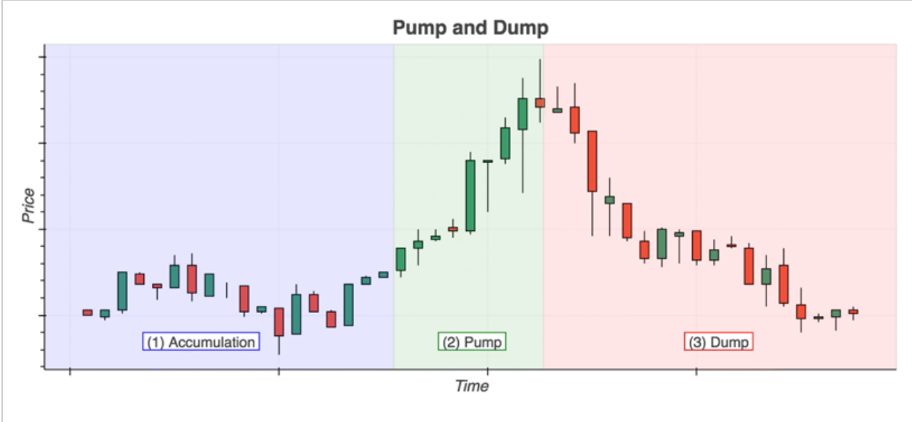
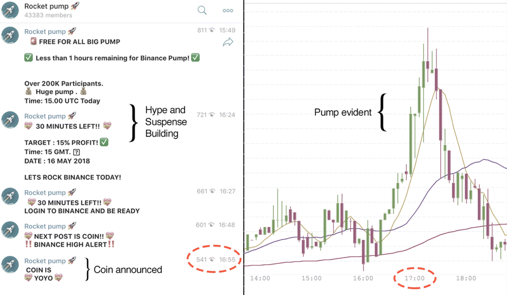
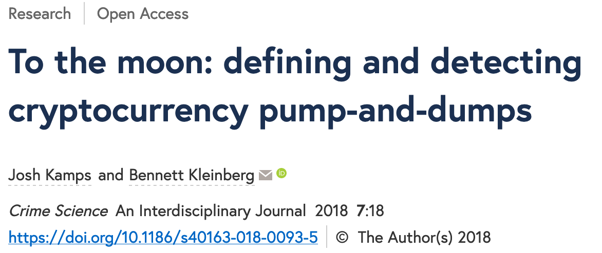

## {data-background="./ucl_artwork/ucl-banner-land-darkblue-rgb.png" data-background-size="70%" data-background-position="top" data-background-opacity="1"}

### **Are cryptocurrencies the future of financial fraud?**

 
 

_Bennett Kleinberg_

<small>Department of Security and Crime Science</small>
 
<small>Dawes Centre for Future Crime</small>
 
<small>University College London</small>

## 
<!-- {data-background="./sharessinger.jpg" data-background-size="50%" data-background-position="center" data-background-opacity="1"} -->

##

## Anatomy of a P&D

<small>The three phases of a pump-and-dump [(Kamps & Kleinberg, 2018)](https://crimesciencejournal.biomedcentral.com/articles/10.1186/s40163-018-0093-5)</small>

## 2 things happened

1. The Internet
2. Cryptocurrencies

##

**What could go wrong?**

##

> The recent explosion of nearly 2,000 cryptocurrencies in a largely unregulated environment has greatly expanded the scope for abuse.

<small>[Hamrick et al., 2018](https://papers.ssrn.com/sol3/papers.cfm?abstract_id=3303365)</small>

##

### The story of [OfficialMcAfee](https://www.buzzfeednews.com/article/ryanmac/heres-how-scammers-are-using-fake-news-to-screw-with-bitcoin) and [OfficiallMcAfee](https://www.buzzfeednews.com/article/ryanmac/heres-how-scammers-are-using-fake-news-to-screw-with-bitcoin).

<small>from: [Mac & Lytvynenko, Buzzfeed, 2018](https://www.buzzfeednews.com/article/ryanmac/heres-how-scammers-are-using-fake-news-to-screw-with-bitcoin)</small>

## Coin of the day ...

> When the tweet was first broadcast at around 3 p.m. ET, GVT was bought and sold on the market at $30.

##

> When the tweet was first broadcast at around 3 p.m. ET, GVT was bought and sold on the market at $30.

> By 3:04, it was at $45, and trading volume had doubled.

##

> When the tweet was first broadcast at around 3 p.m. ET, GVT was bought and sold on the market at $30.

> By 3:04, it was at $45, and trading volume had doubled.

> But by 3:19, GVT's price had fallen back to $30.

## Morale of the story

> The smart money — the early money — had gotten out, leaving the late money holding a bag of now-diminished value.

## Crypto P&Ds

| Old challenges               	| New challenges                     	|
|------------------------------	|------------------------------------	|
| low market cap               	| faster time scale (near real-time) 	|
| lack of reliable information 	| broader spread of misinformation   	|
| low price                    	| new vehicles for "rumours"         	|

## 

### Yes, yes, yes... but what do I care?

"It's just another problem"

<!-- cash analogy -->

## A problem with **$$$** involved

- $50m (Onecoin)
- $825m over six months
- [$222m for a single group](https://www.wsj.com/graphics/cryptocurrency-schemes-generate-big-coin/)

## The "grey zone" problem

## 

### Can we detect P&Ds?

## Data

- scraped cryptocurrency exchange data
- trading data of 1-h granularity
- 20 days of trading, 5 exchanges, 977 trading pairs

<small>Data + code available at [https://osf.io/827wd/](https://osf.io/827wd/)</small>

## Criteria for P&Ds

- sudden price increase (PUMP)
- sudden volume increase (PUMP)
- marked price drop (DUMP)

_Conditional local point anomaly detection_

## Anomalie parameters

<!-- |                   	| Strict parameters 	| Balanced parameters 	| -->
<!-- |-------------------	|-------------------	|---------------------	| -->
<!-- | Estimation window 	| 24h               	| 12h                 	| -->
<!-- | Volume increase   	| 400%              	| 300%                	| -->
<!-- | Price increase    	| 10%               	| 5%                  	| -->
<!-- | Price drop        	| 1.00 SD           	| 1.00 SD             	| -->
<!-- | Alleged pumps     	| 920               	| 2150                	| -->
<!-- | Pump-and-dumps    	| 485               	| 1617                	| -->
<!-- | Crypto/crypto     	| 97.9%             	| 97.0%               	| -->
<!-- | Low market cap    	| 84.9%             	| 81.8%               	| -->

|                   	| Balanced parameters 	|
|-------------------	|---------------------	|
| Estimation window 	| 12h                 	|
| Volume increase   	| 300%                	|
| Price increase    	| 5%                  	|
| Price drop        	| 1.00 SD             	|
| Alleged pumps     	| 2150                	|
| Pump-and-dumps    	| 1617                	|
| Crypto/crypto     	| 97.0%               	|
| Low market cap    	| 81.8%               	|

## P&D detection

## Findings

- **potential for detectability**
- **mainly crypto/crypto pairs**
- **mostly low market cap**

## Intermezzo: situational crime prevention

- away from the criminological-sociological model
- away from the "individual-centric" model
- fraud/crime as a complex problem
- ... embedded in a situation
- robust effect: clustering

## What does this mean for cryptocurrency?

- understanding the  _P&D situation_
- Does clustering occur?

## Zooming in

- Exchange-level
    - % of traded coins $\neq$ % of P&Ds
    - Some exchanges are used more often than others
    - e.g. "Kraken": 6% of traded coins, < 1% of P&Ds
    - among most regulated marketplaces

## Zooming in

- Coin-level
    - Most are never targeted
    - Some are targeted again and again
    - 30% of coins $\sim$ 80% of P&Ds

## Repeat victimisation of coins

## Core findings

- potential for detectability
- mainly crypto/crypto pairs
- mostly low market cap
- **repeat exchange victimisation**
- **repeat coin victimisation**
- no evidence for _"Bitcoin is not immune from the pump-and-dump phenomenon"_ (Hamrick et al., 2018)

## In context

- P&D groups successful in pumping the price
- (very) short timeframe
- Telegram and Discord used for organising and coordination

<small>see [Kamps & Kleinberg, 2018](https://doi.org/10.1186/s40163-018-0093-5); [Xu & Livshits, 2018](https://arxiv.org/pdf/1811.10109.pdf); [Hamrick et al., 2018](https://papers.ssrn.com/abstract=3303365); [Li et al., 2018](https://papers.ssrn.com/abstract=3267041)</small>

## Maybe there's more to the coins...

High-potential coins and coin malleability

[Kamps & Kleinberg, forthcoming]()

##

> Arguably, the decision to choose one coin for a pump-and-dump scheme and not another are not random but rather subject to cost-benefit processes.

> [...] if one is targeting a coin for a P&D, it is useful to be able to manipulate a coin’s price as much as possible, while using the least amount of capital

## Coin malleability

"the percentage price increase that a coin would experience, with respect to a certain amount of volume injected"

##

- data
    - 239 x/BTC pairs
    - scraped in April 2019
- levels of BTC injection
    - 0.25 BTC (~ $1,300)
    - 1.00 BTC (~ $5,100)
    - 5.00 BTC (~ $25,500) 
    - 10.00 BTC (~ $51,000)

##

##

## Key findings on coin malleability

_Not all coins are equal!_

- some coins are more malleable than others
- trading volume highly clustered
- malleability not identical to low volume
- possible explanation: too low volume doesn't do the trick!

##

### Vision on research & bigger picture

## Old-school approach

1. detection
2. prevention

Circular problem.

## Ongoing research

- Detection:
    - (Weak) signals in the accumulation phase
    - (Weak) signals in the pump phase
- Anticipation:
    - Changes in MO
    - Transition to new targets (coins)

Interdisciplinary challenge!

##

## New problems

- Twitter impersonations
- New means to spread information
- Transactions in milliseconds

## New questions

- trust
    - how do groups maintain internal trust?
    - how do they punish?

## New questions

- trust
- decision-making processes
    - how are targets chosen?
    - what is the cost-benefit process?
    - what do we not see?

## Situational prevention

- does displacement happen?
    - how?
    - where to?

## Vision on research

1. collaboration between universities, fintech, government, banks, "citizen science"

##

## Vision on research

(unrealistic but cool)

2. infiltration of P&D groups
3. own P&D

## Are cryptocurrencies the future of financial fraud?

~~Yes~~ ~~Maybe~~ Probably ~~No~~

## 

What do we not know?

What are the challenges for the future?

**10th + 11th June, Crypto-fraud "sandpit"**

## End.

Credits to the team: Josh Kamps, Florian Hetzel.

<small>bennett.kleinberg@ucl.ac.uk // [bkleinberg.net](https://bkleinberg.net/)</small>

-------

