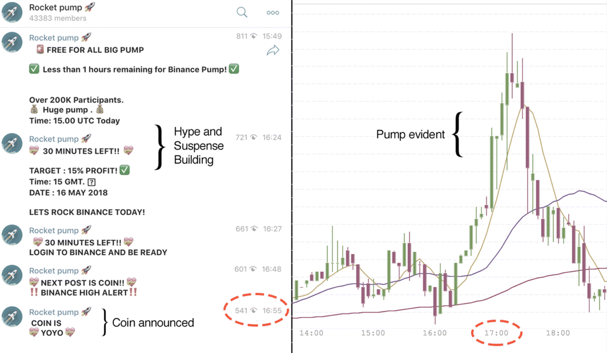
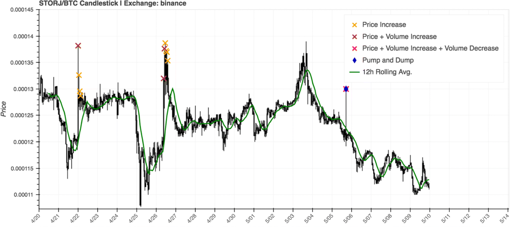
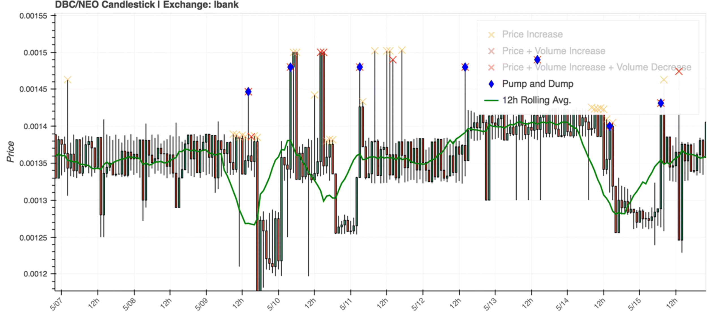

## {data-background="./ucl_artwork/ucl-banner-land-darkblue-rgb.png" data-background-size="70%" data-background-position="top" data-background-opacity="1"}

**Are cryptocurrencies the future of fraud?**

Bennett Kleinberg

Dawes Centre for Future Crime, UCL

## {data-background="./sharessinger.jpg" data-background-size="50%" data-background-position="center" data-background-opacity="1"}

<!--  -->

## Anatomy of a P&D

<small>The three phases of a pump-and-dump operation [(Kamps & Kleinberg, 2018)](https://crimesciencejournal.biomedcentral.com/articles/10.1186/s40163-018-0093-5)</small>

## Two important events

1. The Internet happened
2. Cryptocurrencies

##

**What could go wrong?**

## Crypto P&Ds

| Old challenges               	| New challenges                     	|
|------------------------------	|------------------------------------	|
| low market cap               	| faster time scale (near real-time) 	|
| lack of reliable information 	| broader spread of misinformation   	|
| low price                    	| new vehicles for "rumours"         	|

## P&D in the wild

## 

### Can we detect them automatically?

## Data

- scraped cryptocurrency exchange data
- trading data of 1-h granularity
- 20 days of trading, 5 exchanges, 977 trading pairs

<small>Data + code available at [https://osf.io/827wd/](https://osf.io/827wd/)</small>

## Criteria for P&Ds

- sudden price increase (PUMP)
- sudden volume increase (PUMP)
- marked price drop (DUMP)

_Conditional local point anomaly detection_

## Anomaly parameters

<!-- |                   	| Strict parameters 	| Balanced parameters 	| -->
<!-- |-------------------	|-------------------	|---------------------	| -->
<!-- | Estimation window 	| 24h               	| 12h                 	| -->
<!-- | Volume increase   	| 400%              	| 300%                	| -->
<!-- | Price increase    	| 10%               	| 5%                  	| -->
<!-- | Price drop        	| 1.00 SD           	| 1.00 SD             	| -->
<!-- | Alleged pumps     	| 920               	| 2150                	| -->
<!-- | Pump-and-dumps    	| 485               	| 1617                	| -->
<!-- | Crypto/crypto     	| 97.9%             	| 97.0%               	| -->
<!-- | Low market cap    	| 84.9%             	| 81.8%               	| -->

|                   	| Balanced parameters 	|
|-------------------	|---------------------	|
| Estimation window 	| 12h                 	|
| Volume increase   	| 300%                	|
| Price increase    	| 5%                  	|
| Price drop        	| 1.00 SD             	|
| Alleged pumps     	| 2150                	|
| Pump-and-dumps    	| 1617                	|
| Crypto/crypto     	| 97.0%               	|
| Low market cap    	| 81.8%               	|

## P&D detection

## Core findings

- **potential for detectability**
- **mainly crypto/crypto pairs**
- **mostly low market cap**

## Zooming in

- Exchange-level
    - % of traded coins $\neq$ % of P&Ds
    - Some exchanges are used more often than others
    - e.g. "Kraken": 6% of traded coins, < 1% of P&Ds
    - among most regulated marketplaces

## Zooming in

- Coin-level
    - Most are never targeted
    - Some are targeted again and again
    - 30% of coins $\sim$ 80% of P&Ds

## Repeat victimisation of coins

## Core findings

- potential for detectability
- mainly crypto/crypto pairs
- mostly low market cap
- **repeat exchange victimisation**
- **repeat coin victimisation**

<!-- ## Real-world tests -->

<!--  -->

##

### Outlook & bigger picture

<!-- ## New problems -->

<!-- - Twitter impersonation -->
<!-- - Announcements change -->
<!-- - Trading in the milliseconds -->

## New questions

- What are the characteristics of repeat victims?
- How is misinformation spread?
- How are groups building trust?
- What's more than pump-and-dumps?

## Ongoing work

- Detection:
    - Signals in the accumulation phase
    - Signals in the pumping phase
- Anticipation:
    - Changes to MO
    - Transition to new targets

Interdisciplinary challenge!

## Bigger picture

**If you had to design policing from scratch ...**

- fully embrace data
- avoid catch phrases ("big data", "AI")
- solve the capabilities problem
- **go "open data"**

Worst case: the gap becomes so wide, we're not realising there is one.

## Are cryptocurrencies the future of fraud?

~~Yes~~ Maybe ~~No~~

## Thank you

Collaborator: Josh Kamps

<small>bennett.kleinberg@ucl.ac.uk // [bkleinberg.net](https://bkleinberg.net/)</small>

